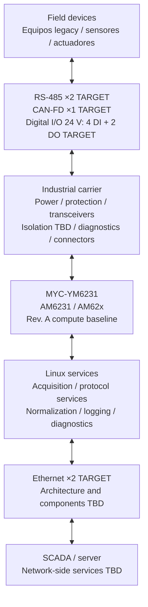
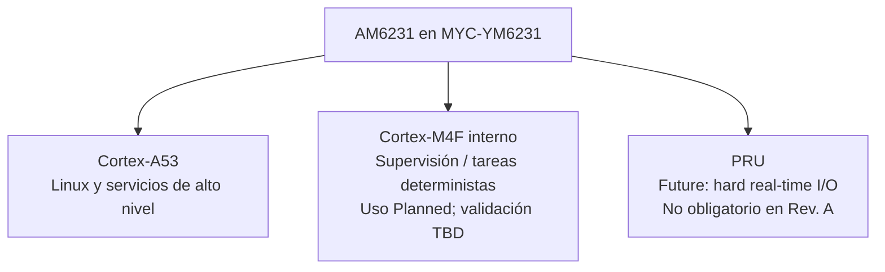
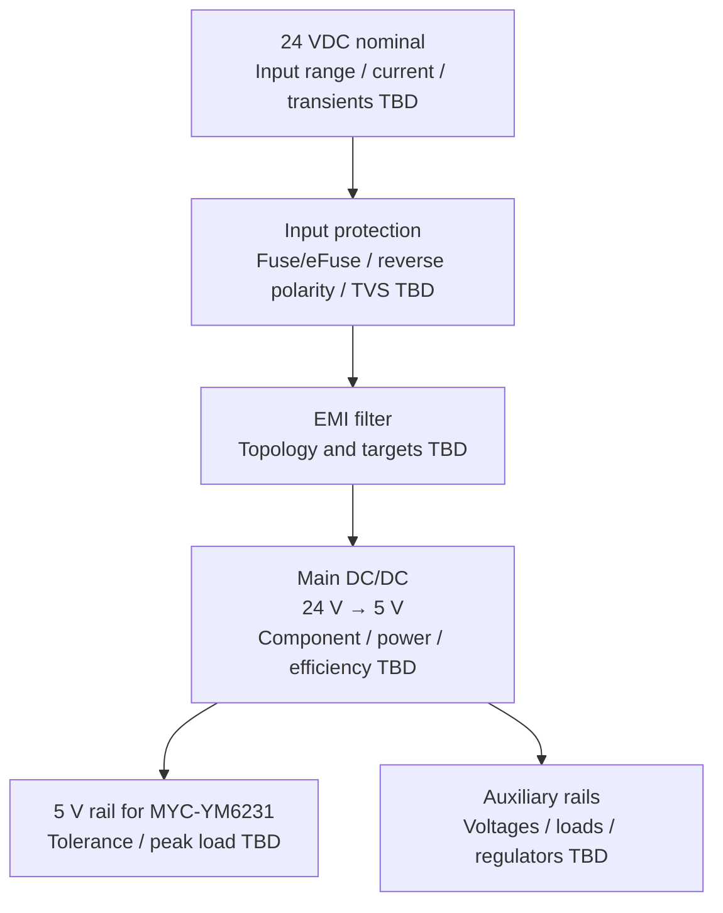

# Industrial Linux Edge Gateway

## Revisión 0.3 — Especificación técnica preliminar de producto y sistema

| Campo | Valor |
|---|---|
| Proyecto | Industrial Linux Edge Gateway (nombre provisional) |
| Tipo de documento | Especificación técnica preliminar de producto y sistema |
| Revisión | 0.3 |
| Estado | Preliminar; baseline de Rev. A aceptado, no liberado para diseño detallado ni producción |
| Fecha | 2026-09-13 |
| Propietario | Equipo del proyecto universitario de Diseño Electrónico |
| Archivo maestro | `docs/industrial_linux_gateway_requirements.md` |

> **Estado de plataforma.** El SoM **MYC-YM6231**, basado en **TI AM6231 / familia AM62x**, queda seleccionado como **ACCEPTED / BASELINE FOR REV A**. La selección habilita el diseño preliminar y no constituye una selección definitiva para producción comercial. La variante exacta, memoria, capacidad de eMMC, disponibilidad real de cada señal en conectores, soporte del BSP, consumo, comportamiento térmico y ciclo de suministro deben verificarse antes de congelar el diseño.

---

## 1. Propósito, descripción y alcance

Este documento define el baseline técnico preliminar de un gateway industrial Linux destinado a integrar equipos de campo heterogéneos con redes IP, servicios de supervisión, servidores o sistemas SCADA. Conserva los requisitos y decisiones de revisiones anteriores, registra los cambios de arquitectura ya aceptados y separa explícitamente los objetivos de Rev. A de los valores y componentes todavía pendientes.

### 1.1 Problema

Los entornos industriales combinan equipos con RS-485, CAN, señales digitales de 24 V, interfaces Ethernet y dispositivos legacy que no ofrecen integración directa con servicios IP modernos. Las diferencias de interfaz eléctrica, protocolo, referencia de tierra, protección, temporización y mantenibilidad impiden conectar esos equipos directamente a una red superior de forma defendible.

El problema de ingeniería no es solo traducir datos. El sistema debe:

- adaptar y proteger las interfaces eléctricas de campo;
- adquirir, validar, asociar tiempo y normalizar información;
- traducir protocolos sin asumir control crítico en tiempo real;
- conservar datos y evidencia diagnóstica ante fallos razonables;
- ofrecer configuración, mantenimiento y recuperación reproducibles;
- separar la electrónica expuesta al entorno industrial del dominio de cómputo Linux.

### 1.2 Solución propuesta y propósito

La solución se compone de un SoM Linux y una carrier board propia. El SoM aporta procesamiento, memoria DDR, almacenamiento eMMC, PMIC y periféricos digitales; la carrier implementa entrada de alimentación industrial, protección, conversión, transceptores, acondicionamiento de E/S, conectores, diagnóstico y características de prueba.

El producto actúa como puente entre:

| Lado | Función |
|---|---|
| **FIELD SIDE** | Conexión a RS-485, CAN-FD, E/S digitales de 24 V y equipos Ethernet de máquina. |
| **NETWORK / SERVER SIDE** | Comunicación IP con SCADA, servidor, servicios de gestión o API seleccionada. |

Las capacidades objetivo comprenden adquisición, traducción de protocolos, procesamiento local, almacenamiento, logging, diagnóstico y comunicación con servidor. El gateway no se define como controlador de seguridad ni como plataforma de control crítico de tiempo real.

### 1.3 Filosofía de diseño

| Principio | Aplicación al proyecto |
|---|---|
| Modularidad | Separar el SoM de la carrier y mantener límites eléctricos y lógicos documentados. |
| Robustez | Definir protección, retornos de corriente, aislamiento y comportamiento ante fallos según evidencia del entorno. |
| Mantenibilidad | Proporcionar identificación de versiones, logs, consola de servicio, actualización y recuperación documentadas. |
| Testabilidad | Incorporar puntos de prueba, diagnóstico por bloques y procedimientos reproducibles desde Rev. A. |
| Escalabilidad | Reservar capacidades del SoC y expansión externa sin convertirlas en requisitos de Rev. A. |
| Separación de dominios | Mantener el cómputo Linux separado de transceptores y front-ends expuestos al campo. |
| Diseño industrial | Tratar alimentación, ESD/EFT/surge, grounding, conectores y mecánica como partes del sistema. |
| Trazabilidad | Vincular decisiones, requisitos, TBD y evidencia de verificación mediante IDs estables. |

### 1.4 Alcance de Rev. A

#### In Scope

- selección y validación preliminar del SoM MYC-YM6231;
- diseño de la carrier board y su integración mecánica;
- entrada industrial nominal de 24 VDC, regulación, filtrado y protección;
- dos interfaces Ethernet como arquitectura objetivo;
- dos canales RS-485 y un canal CAN-FD como arquitectura objetivo;
- cuatro entradas digitales industriales de 24 V y dos salidas digitales industriales como arquitectura objetivo;
- una o dos interfaces USB para servicio o expansión;
- UART de mantenimiento, indicadores de estado y estrategia de watchdog;
- integración Linux, drivers, adquisición y servicios básicos;
- logging, almacenamiento local, timestamping, configuración y diagnóstico;
- validación eléctrica, funcional y de comunicaciones;
- documentación, DFM y DFT básicas.

#### Out of Scope para Rev. A

- diseño RF, Wi-Fi integrado, antenas propias o LTE integrado directamente en la PCB;
- diseño de DDR, eMMC o PMIC alrededor de un SoC desnudo;
- GPU como requisito de aplicación;
- pantalla local o GUI en pantalla integrada;
- certificación del producto completo o declaración de cumplimiento EMC;
- seguridad funcional certificada;
- visión artificial, IA o control de motores;
- interfaces analógicas industriales 0–10 V o 4–20 mA sin un caso de uso que las justifique;
- MCU externo adicional.

#### Future Expansion

- LTE mediante módulo comercial externo;
- entradas 4–20 mA y 0–10 V;
- uso avanzado del Cortex-M4F interno;
- uso de PRU para I/O determinista o protocolos especializados;
- TSN, secure boot y actualizaciones firmadas;
- monitorización avanzada y canales adicionales CAN o RS-485;
- MCU externo solo si aparece un requisito específico conforme a §3.3.

### 1.5 Convenciones

- **Deberá:** requisito verificable; **TBD:** parámetro, componente o decisión pendiente de evidencia.
- **Must / Should / Could / Won't:** prioridad MoSCoW para Rev. A.
- **Accepted:** decisión vigente; **Preliminary Accepted:** baseline de diseño sujeto a validación; **Planned:** uso reservado, no dependencia obligatoria; **Deferred:** fuera de Rev. A; **Superseded:** decisión histórica reemplazada.
- Una cantidad marcada **TARGET / PRELIMINARY BASELINE** orienta la arquitectura, pero no se considera congelada hasta cerrar sus criterios de aceptación.
- **Origen:** necesidad, caso de uso o decisión que justifica el requisito.
- Producto (§5) define comportamiento; sistema (§7) lo descompone por responsabilidad.

### 1.6 Verificación

| Código | Método | Evidencia |
|---|---|---|
| I | Inspección | Documentación, configuración, montaje o marcado. |
| A | Análisis | Cálculo, simulación o evaluación técnica. |
| T | Ensayo | Medición o estímulo controlado. |
| D | Demostración | Ejecución funcional representativa. |

Un requisito no puede cerrarse mientras su criterio de aceptación siga siendo TBD.

---

## 2. Contexto y Decision Register

### 2.1 Hechos conocidos

| ID | Hecho |
|---|---|
| H-01 | El MYC-YM6231 es la plataforma de cómputo seleccionada como baseline de Rev. A; no está congelada para producción comercial. |
| H-02 | El proyecto incluye el diseño de una carrier board industrial específica. |
| H-03 | El sistema integrará equipos industriales externos con una red IP, servidor o SCADA. |
| H-04 | No existe todavía esquemático ni PCB del gateway. |
| H-05 | No se han realizado ensayos eléctricos o funcionales del gateway completo. |
| H-06 | DDR, eMMC y PMIC se integran a nivel de SoM; sus variantes y capacidades exactas permanecen TBD. |
| H-07 | Rev. A no incorpora un MCU externo adicional. |

### 2.2 Baseline funcional objetivo de Rev. A

| Elemento | Objetivo preliminar | Estado |
|---|---|---|
| Plataforma Linux | MYC-YM6231, TI AM6231 / AM62x | Accepted / Baseline for Rev. A |
| Ethernet | 2 × Gigabit Ethernet | Preliminary Accepted; arquitectura física TBD |
| RS-485 | 2 × canales independientes | Preliminary Accepted; transceptores y parámetros TBD |
| CAN | 1 × CAN-FD | Preliminary Accepted; transceptor y parámetros TBD |
| Entradas digitales | 4 × entradas industriales de 24 V | Preliminary Accepted; front-end y umbrales TBD |
| Salidas digitales | 2 × salidas industriales | Preliminary Accepted; tipo, carga y estado seguro TBD |
| USB | 1–2 × interfaces de servicio/expansión | Target; función y conectores TBD |
| Servicio | UART de consola/mantenimiento | Target; implementación TBD |
| Almacenamiento | eMMC integrada en el SoM | Accepted conceptualmente; capacidad y resistencia TBD |
| Indicadores | Alimentación, sistema y fault; actividad adicional si es práctica | Target; cantidad y semántica TBD |
| Alimentación | Entrada nominal de 24 VDC → protección → filtro → DC/DC → 5 V para SoM | Preliminary Accepted; parámetros y componentes TBD |

### 2.3 Decision Register

Se preservan los IDs `D-*` de las revisiones anteriores. Las decisiones solicitadas para esta revisión se incorporan sin duplicar las ya existentes.

| ID | Decisión | Estado | Justificación / consecuencia |
|---|---|---|---|
| D-01 | Arquitectura Linux con separación entre plataforma de cómputo y carrier industrial. | Accepted | Linux asume servicios de alto nivel; la carrier concentra alimentación, protección e interfaces de campo. |
| D-02 | Ethernet cableado como uplink principal. | Accepted | Proporciona la interfaz primaria con la red superior y facilita integración y diagnóstico IP. |
| D-03 | Wi-Fi fuera del alcance inicial. | Accepted | Rev. A no incorpora conectividad Wi-Fi integrada. |
| D-04 | LTE solo mediante módulo comercial externo o expansión futura. | Deferred | Evita diseño RF propio y mantiene LTE fuera de la función base. |
| D-05 | Sin antena ni front-end RF propio. | Accepted | El diseño de RF no forma parte de Rev. A. |
| D-06 | No seleccionar plataforma ni componentes en la revisión 0.2. | Superseded by D-07 | Se conserva por trazabilidad histórica; ya no describe el estado vigente. |
| D-07 | MYC-YM6231 basado en TI AM6231 / AM62x como plataforma de cómputo de Rev. A. | **Accepted / Baseline for Rev. A** | SoC orientado a gateway/embedded Linux; 1 × Cortex-A53 para Linux y servicios de alto nivel; Cortex-M4F y PRU disponibles; soporte Linux; DDR, eMMC y PMIC integrados a nivel SoM; UART, CAN-FD, Ethernet, USB, SPI, I²C y GPIO disponibles sujeto a validación del pinout. Reduce la complejidad frente a diseñar DDR, PMIC y almacenamiento alrededor de un SoC desnudo y evita sobredimensionamiento innecesario. No es selección definitiva de producción. |
| D-08 | No utilizar MCU externo adicional en Rev. A. | Accepted | El Cortex-A53, Cortex-M4F y recursos PRU cubren las clases de tarea hoy identificadas. Un MCU externo aumentaría BOM, consumo, firmware, comunicación interna y modos de fallo sin requisito demostrado. |
| D-09 | Reservar el Cortex-M4F interno para supervisión y tareas deterministas. | Accepted / Planned | Su uso dependerá de validar BSP, toolchain, acceso a periféricos, comunicación inter-core y estrategia de recuperación. Rev. A no dependerá obligatoriamente del M4F. |
| D-10 | Reservar PRU para I/O determinista, temporización precisa o protocolos propietarios futuros. | Deferred | La PRU es capacidad disponible, no requisito obligatorio de Rev. A. |
| D-11 | Dos interfaces Gigabit Ethernet como arquitectura objetivo. | Preliminary Accepted | Permite separar potencialmente red de planta y red de máquina; topología, PHY y conectores permanecen TBD. |
| D-12 | Dos canales RS-485 independientes como arquitectura objetivo. | Preliminary Accepted | Soportan integración de buses/equipos separados; transceptores, aislamiento y parámetros permanecen TBD. |
| D-13 | Un canal CAN-FD en Rev. A. | Preliminary Accepted | El transceptor, aislamiento, velocidad, terminación y protocolo permanecen TBD. |
| D-14 | Cuatro entradas digitales de 24 V y dos salidas digitales industriales como arquitectura objetivo. | Preliminary Accepted | Front-ends, drivers, niveles, cargas, diagnóstico y estados seguros permanecen TBD. |
| D-15 | Entrada nominal de 24 VDC. | Preliminary Accepted | El rango, potencia y perfil de perturbaciones deben definirse antes de seleccionar protección y conversión. |
| D-16 | Sin pantalla local en Rev. A. | Accepted | La operación y configuración se realizarán mediante interfaces de red y servicio. |
| D-17 | Uso de PC externo para mantenimiento y configuración. | Accepted | El acceso previsto comprende Ethernet/SSH y UART de servicio según disponibilidad y política de acceso TBD. |

### 2.4 Candidatos y decisiones todavía abiertas

| ID | Elemento | Estado y condición para decidir |
|---|---|---|
| C-01 | Perfil completo de alimentación de 24 VDC | Rango, corriente, transientes, hold-up y entorno TBD. |
| C-02 | Parámetros eléctricos y de protocolo de RS-485 | La cantidad objetivo está aceptada; velocidad, dúplex, terminación, polarización y aislamiento están abiertos. |
| C-03 | Parámetros eléctricos y de protocolo de CAN-FD | El canal está aceptado preliminarmente; velocidad, carga, terminación, aislamiento y protocolo están abiertos. |
| C-04 | Front-end de cuatro entradas digitales | Cantidad objetivo aceptada; tipo, umbrales, corriente, protección y diagnóstico TBD. |
| C-05 | Etapa de dos salidas digitales | Cantidad objetivo aceptada; tipo, cargas, estado seguro, protección y diagnóstico TBD. |
| C-06 | Entradas analógicas 0–10 V o 4–20 mA | Could / Future Expansion; requieren caso de uso y requisitos metrológicos. |
| C-07 | MCU externo | Won't para Rev. A por D-08; solo se reabre ante los criterios de §3.3. |
| C-08 | Aislamiento galvánico por interfaz o dominio | Requiere análisis de tierras, cableado, fallos, EMC y costo. |
| C-09 | Supervisor/watchdog externo | Requiere matriz fallo-detector-acción y justificar independencia respecto al SoM. |

### 2.5 Supuestos de trabajo

| ID | Supuesto | Acción de validación |
|---|---|---|
| S-01 | El demostrador dispondrá de al menos un equipo industrial con interfaz documentada. | Identificar equipo, manual, protocolo y acceso para ensayos. |
| S-02 | La red superior permitirá pruebas Ethernet con servidor o SCADA. | Definir infraestructura, direccionamiento y servicio de prueba. |
| S-03 | El BSP Linux del SoM permitirá habilitar y configurar los periféricos usados por Rev. A. | Verificar versión, device tree, drivers y restricciones del proveedor. |
| S-04 | El conector y pinout del MYC-YM6231 expondrán recursos suficientes para la arquitectura objetivo. | Auditar esquemático, manual del SoM y asignación de pines antes del esquemático de carrier. |

---

## 3. Arquitectura del sistema

### 3.1 Arquitectura funcional

El diagrama representa límites funcionales, no conexiones eléctricas finales. Cantidades marcadas `TARGET` corresponden al baseline preliminar y sus implementaciones permanecen sujetas a validación.

### 3.2 Arquitectura de procesamiento

#### Cortex-A53 + Linux

| Responsabilidad objetivo | Prioridad Rev. A | Límite actual |
|---|---|---|
| Sistema operativo Linux y arranque de servicios | Must | Distribución, kernel, BSP y configuración TBD. |
| Drivers de interfaces habilitadas | Must | Deben validarse contra el pinout y BSP del SoM. |
| Adquisición, validación y normalización de datos | Must | Variables, tasas, latencia y formato TBD. |
| Logging, almacenamiento local y cola persistente | Must | Capacidad, retención y resistencia de eMMC TBD. |
| Timestamping y orden de eventos | Must | Fuente, exactitud y retención de tiempo TBD. |
| Gestión de red y comunicación con servidor/SCADA | Must | Direccionamiento, protocolos y seguridad TBD. |
| Configuración y diagnóstico | Must | Modelo de datos, permisos y endpoints TBD. |
| Modbus RTU | Should | Aplicable a RS-485; mapa, función y nodos TBD. |
| Modbus TCP | Should | Aplicable si el caso de uso lo requiere. |
| CAN mediante SocketCAN | Should; Must si se activa CAN-FD | Drivers, bitrate y protocolo de capa superior TBD. |
| MQTT | Should | Broker, QoS, esquema y credenciales TBD. |
| SSH para mantenimiento | Should | Política de acceso y hardening TBD. |
| Actualización de software | Should | Mecanismo, autenticación, rollback y firma TBD. |
| API REST | Could | No obligatoria mientras no exista consumidor definido. |
| Interfaz web ligera | Could | Solo si se justifica; no implica pantalla local. |

La lista asigna responsabilidades al dominio Linux; no afirma que todas las funciones `Should` o `Could` se implementarán en Rev. A.

#### Cortex-M4F interno

El Cortex-M4F se reserva para supervisión del sistema, tareas deterministas, watchdog, lectura de sensores internos, señales de fault, gestión de eventos temporales y posibles I/O de baja latencia. Antes de depender de él deben validarse:

- soporte del BSP, firmware y toolchain;
- propiedad y acceso concurrente a periféricos;
- arranque, actualización y recuperación del firmware M4F;
- comunicación inter-core y comportamiento ante fallo de Linux;
- autoridad real sobre reset, alimentación o estados de salida;
- estrategia de prueba y logging.

Mientras esos puntos permanezcan abiertos, las funciones Must de Rev. A deberán poder demostrarse sin convertir el M4F en una dependencia obligatoria.

#### PRU

La PRU queda reservada como capacidad futura para I/O determinista, protocolos propietarios y captura o generación temporal precisa. No se asigna ninguna función Must de Rev. A a la PRU.

### 3.3 Política sobre MCU externo

Rev. A no incorporará un MCU externo. La decisión solo se reabrirá si aparece evidencia de al menos una necesidad que no pueda satisfacerse razonablemente con el SoM y circuitos de supervisión más simples:

- supervisión independiente del dominio de alimentación del SoM;
- power-cycle autónomo del SoM;
- requisito de seguridad funcional;
- aislamiento físico de funciones críticas;
- periféricos necesarios no expuestos por el SoM;
- supervisión que deba continuar con el SoM apagado.

Reabrir la decisión requerirá actualizar D-08, requisitos, presupuesto de potencia, BOM, arquitectura de firmware, comunicaciones internas, pruebas y análisis de nuevos modos de fallo.

### 3.4 Arquitectura preliminar de alimentación

La arquitectura aceptada es `24 VDC nominal → protección → filtrado → conversión DC/DC → 5 V para el MYC-YM6231 + rails auxiliares`. No se selecciona todavía el DC/DC principal ni se fija su potencia.

Antes de seleccionar componentes deben definirse: rango de entrada, presupuesto de corriente, carga pico, objetivo de eficiencia, transientes, inversión de polaridad, surge/EFT, hold-up, brownout y presupuesto térmico.

### 3.5 System Functional Blocks

| # | Bloque | Función | Estado | Dependencia principal | Componentes/subbloques por seleccionar |
|---:|---|---|---|---|---|
| 1 | Linux SoM | Ejecutar Linux, servicios, almacenamiento y periféricos. | MYC-YM6231 accepted para Rev. A | Validación de variante, BSP y pinout | Variante, memoria/eMMC, accesorios térmicos y conectores de mating TBD |
| 2 | Industrial power input | Recibir alimentación industrial nominal de 24 VDC. | Preliminary Accepted | Perfil de instalación | Conector, rango y presupuesto TBD |
| 3 | Input protection | Limitar daño por sobrecorriente, polaridad inversa y transientes. | Required; diseño TBD | Perfil eléctrico/ambiental | Fusible/eFuse, reverse-polarity, TVS TBD |
| 4 | DC/DC conversion | Generar 5 V para SoM desde 24 V nominal. | Architecture accepted; implementación TBD | Potencia, eficiencia, térmica | Convertidor, inductores y pasivos TBD |
| 5 | Ethernet interfaces | Conectar red de planta y potencial red de máquina. | 2 × GbE target | Interfaces expuestas por SoM | PHY/magnetics si aplica, conectores y protección TBD |
| 6 | RS-485 interfaces | Conectar dos buses independientes y soportar Modbus RTU. | Preliminary Accepted | UARTs, aislamiento y topología | Transceptores, terminación, bias y protección TBD |
| 7 | CAN-FD interface | Conectar un bus CAN-FD. | Preliminary Accepted | Controlador SoC, aislamiento y topología | Transceptor, terminación y protección TBD |
| 8 | Digital input front-end | Adaptar cuatro entradas de 24 V al dominio lógico. | Preliminary Accepted | Niveles, corriente y diagnóstico | Front-end, protección, filtros y aisladores TBD |
| 9 | Digital output stage | Accionar dos cargas industriales con estado definido. | Preliminary Accepted | Tipo de carga y estado seguro | Driver, protección y feedback TBD |
| 10 | USB/service interface | Servicio, almacenamiento o expansión externa/LTE. | 1–2 ports target | Roles USB y recursos SoM | Conectores, power switch y ESD TBD |
| 11 | Maintenance console | Exponer consola Linux, boot logs, recuperación y debug. | Target | UART expuesta y niveles eléctricos | Conector/adaptador y protección TBD |
| 12 | Status indicators | Indicar alimentación, heartbeat, fault y actividad práctica. | Target | GPIO, software y panel mecánico | LEDs, drivers, colores y semántica TBD |
| 13 | Supervisor/watchdog strategy | Detectar fallos y ejecutar recuperación con autoridad conocida. | Required strategy; implementación TBD | Matriz fallo-detector-acción | Watchdog interno, M4F o supervisor externo TBD |
| 14 | Isolation strategy | Separar dominios cuando el análisis lo justifique. | Analysis required | Grounding, cables, entorno y costo | Barreras, aisladores y fuentes aisladas TBD |
| 15 | ESD/EFT/surge protection | Proteger conexiones externas según perfil definido. | Analysis required | Objetivos de ensayo TBD | Dispositivos y redes de protección TBD |
| 16 | Grounding strategy | Definir tierras lógica, chasis y campo, retornos y blindajes. | TBD | Envolvente, aislamiento y EMC | Net classes, unión a chasis y terminación de shield TBD |
| 17 | Local storage | Alojar Linux, configuración, logs y datos pendientes. | eMMC on-SoM baseline | Variante y carga de escritura | Capacidad, resistencia, particiones y filesystem TBD |
| 18 | External connectors | Proporcionar conexiones identificadas y retenidas. | TBD | Mecánica, corrientes y cableado | Conectores de power, field, Ethernet, USB y servicio TBD |
| 19 | Test points / DFT | Permitir prueba de rails, reset y señales críticas. | Required | Plan de prueba y layout | Lista, geometría, fixtures y cobertura TBD |
| 20 | Mechanical integration | Alojar SoM/carrier, disipar calor y dar acceso seguro. | TBD | Dimensiones, conectores y térmica | Envolvente, montaje, retención y solución térmica TBD |

### 3.6 Componentes y subbloques pendientes de selección

| Block | Required function | Status | Selection pending |
|---|---|---|---|
| 24 V input connector | Recibir alimentación y mantener polaridad/retención identificables. | TBD | Familia, corriente, pitch, orientación y retención |
| Fuse / eFuse | Limitar sobrecorriente y energía de fallo. | TBD | Tecnología, rating, coordinación y recuperación |
| Reverse polarity protection | Evitar daño bajo el perfil de polaridad definido. | TBD | Topología, pérdida y rating |
| TVS | Limitar transientes en la entrada y puertos aplicables. | TBD | Tipo, standoff, clamp y energía según perfil TBD |
| EMI filter | Atenuar perturbaciones conducidas. | TBD | Topología, corner, damping y componentes |
| Main DC/DC 24 V → 5 V | Alimentar el SoM con margen. | TBD | Controlador/módulo, frecuencia, potencia y magnetics |
| Auxiliary regulators | Generar rails adicionales de carrier. | TBD | Tensiones, secuencia, cargas y reguladores |
| Ethernet PHY / magnetics if required | Implementar enlaces Ethernet según arquitectura del SoM. | TBD after pinout review | PHY, magnetics, clocks y termination si aplica |
| Ethernet connector | Conectar hasta dos enlaces y soportar mecánica/protección. | TBD | Con/sin magnetics, LEDs, shield y retención |
| RS-485 transceivers | Adaptar dos canales UART/bus. | TBD | Transceptor, supply, isolation, duplex y fail-safe |
| CAN-FD transceiver | Adaptar controlador CAN al bus. | TBD | Transceptor, bitrate capability, isolation y standby |
| Digital input front-end | Adaptar cuatro entradas de 24 V. | TBD | Topología, thresholds, filtering, isolation y diagnostics |
| Digital output driver | Accionar dos salidas industriales. | TBD | High/low side, load rating, protection y feedback |
| Isolators | Cruzar barreras justificadas. | TBD after isolation analysis | Tecnología, canales, ratings y isolated power |
| USB connector / protection | Exponer 1–2 puertos de servicio/expansión. | TBD | Tipo de conector, role, ESD y power switch |
| UART/service interface | Proporcionar consola segura y accesible. | TBD | Nivel lógico, conector, adapter y protección |
| LEDs | Mostrar estados no ambiguos. | TBD | Cantidad, color, brillo, driver y ubicación |
| Temperature / board monitoring sensor | Medir condición de placa si el análisis lo requiere. | Conditional / TBD | Necesidad, sensor, ubicación y bus |
| Watchdog / supervisor | Recuperar fallos no cubiertos si se justifica dispositivo externo. | Conditional / TBD | Cobertura, independencia, timeout y autoridad |
| Field connectors | Conectar RS-485, CAN-FD y E/S. | TBD | Familia, poles, current, keying y shield |
| Test points | Facilitar bring-up, fabricación y diagnóstico. | Required; details TBD | Señales, formato, acceso y fixture |

### 3.7 Flujo conceptual de datos y comandos

| Dirección | Flujo |
|---|---|
| Adquisición | Field device → physical interface → transceiver/input stage → SoM peripheral → Linux driver → protocol service → normalization → local processing → logging → network service → SCADA/server |
| Comando | SCADA/server → Ethernet → Linux application → authorization/validation TBD → protocol handler → field interface → device |

Los comandos solo se habilitarán para casos de uso y actores autorizados. El gateway no se asume apto para lazo de control crítico o respuesta hard real-time; latencia, pérdida de enlace y estados seguros deben definirse por caso de uso.

### 3.8 Arquitectura de comunicaciones

| Interfaz | Objetivo | Uso previsto | Pendiente |
|---|---|---|---|
| Ethernet | Hasta dos interfaces Gigabit | Uplink principal; posible separación planta/máquina | Topología, PHY/magnetics, routing/bridge, conector y protección TBD |
| RS-485 | Dos canales independientes | Modbus RTU y equipos legacy | Transceptores, aislamiento, duplex, bias, terminación y bitrate TBD |
| CAN-FD | Un canal en Rev. A | SocketCAN y protocolo de aplicación TBD | Transceptor, aislamiento, bitrate, terminación y carga TBD |
| USB | Una o dos interfaces | Mantenimiento, expansión, módem LTE externo o almacenamiento | Roles, alimentación, conectores y protección TBD |
| UART de servicio | Una consola accesible | Consola Linux, boot logs, recuperación y debug | Nivel, conector, acceso y protección TBD |

### 3.9 Diagnóstico y mantenimiento

| Capacidad | Prioridad | Alcance preliminar |
|---|---|---|
| Power LED | Should | Presencia de rail/estado a definir; no sustituye medición. |
| System/heartbeat LED | Should | Estado y fuente de control TBD. |
| Network/link status | Should | Indicadores del conector, software o ambos TBD. |
| Fault indicator | Should | Causas agrupadas y semántica TBD. |
| Actividad RS-485/CAN | Could | Solo si es práctica y no afecta integridad de señal. |
| Boot logs | Must | Accesibles mediante UART o medio equivalente validado. |
| Linux logs | Must | Persistencia, rotación y retención TBD. |
| Watchdog | Should | Cobertura, timeout y autoridad TBD. |
| Maintenance console | Should | UART de servicio y/o consola de red controlada. |
| SSH | Should | Política de acceso y configuración segura TBD. |
| Diagnostics endpoint | Should | Interfaz, autenticación y datos expuestos TBD. |
| Test points | Must | Rails y señales críticas definidos durante diseño. |

---

## 4. Actores y casos de uso

| Actor | Interacción |
|---|---|
| Equipo industrial | Datos, estados y comandos autorizados mediante RS-485, CAN-FD, E/S digital o Ethernet según el caso. |
| Servidor/SCADA/API | Recepción de datos, consulta de estado y configuración o comandos autorizados por Ethernet/IP. |
| Técnico/usuario | Instalación, configuración, diagnóstico, actualización y recuperación desde PC externo; acceso y permisos TBD. |
| Fuente industrial | Energía nominal de 24 VDC dentro del perfil TBD. |
| Red Ethernet | Conectividad IP, incluidas interrupciones temporales y potencial separación de redes. |

| Caso | Comportamiento esperado |
|---|---|
| UC-01 — Integrar un equipo con IP | Con equipo, interfaz y protocolo documentados: adquirir, validar, normalizar y transmitir datos; asociar tiempo cuando aplique y registrar resultados. Manejar datos inválidos, interfaz/red no disponible y rechazo del servidor. |
| UC-02 — Interrupción de red | Detectar indisponibilidad, conservar datos pendientes dentro de la capacidad definida y recuperar transferencia sin borrar antes del criterio de entrega. |
| UC-03 — Fallo de alimentación | Detectar o tolerar degradación, limitar corrupción y estados indeterminados; autoarrancar, comprobar estado y recuperar operación o informar fallo. |
| UC-04 — Diagnóstico de campo | Distinguir fallos de alimentación, SoM, carrier, campo y red; consultar versiones/configuración, ejecutar recuperación autorizada y registrar resultado. |
| UC-05 — Configuración y mantenimiento | Validar cambios antes de activarlos, actualizar de forma controlada y recuperar versión/configuración operativa ante fallo. |
| UC-06 — Verificación integrada | Identificar la unidad, probar alimentación, interfaces y diagnóstico, y registrar versiones/resultados; localizar fallos hasta un bloque mantenible cuando sea posible. |

---

## 5. Requisitos de producto

### 5.1 Requisitos funcionales

| ID | Requisito | Especificación/valor | MoSCoW Rev. A | Origen |
|---|---|---|---|---|
| F-01 | El producto deberá adquirir datos de al menos un equipo industrial representativo del caso de uso seleccionado. | Equipo, datos, tasa y protocolo: TBD | Must | UC-01 |
| F-02 | El producto deberá comunicarse mediante al menos una interfaz de campo del baseline aceptado. | RS-485, CAN-FD, E/S digital o Ethernet; selección del demostrador TBD | Must | UC-01, D-11 a D-14 |
| F-03 | El producto deberá procesar localmente los datos necesarios para el caso de uso demostrador. | Validación, normalización y latencia: TBD | Must | UC-01 |
| F-04 | El producto deberá transmitir a un servidor/SCADA los datos definidos mediante Ethernet cableado. | Protocolo, formato, seguridad y rendimiento: TBD | Must | UC-01, D-02 |
| F-05 | El producto deberá detectar una interrupción de comunicación con el destino superior. | Tiempo y criterio de detección: TBD | Must | UC-02 |
| F-06 | El producto deberá almacenar temporalmente datos pendientes y reanudar transferencia al recuperarse la conectividad. | Capacidad, retención y política de reenvío: TBD | Must | UC-02 |
| F-07 | El producto deberá arrancar automáticamente y recuperar una condición operativa definida después del retorno de alimentación válida. | Tiempo de recuperación y estado operativo: TBD | Must | UC-03 |
| F-08 | El producto deberá proporcionar diagnóstico de alimentación, comunicaciones de campo, Linux y enlace superior hasta el nivel soportado. | Variables, acceso y granularidad: TBD | Must | UC-01, UC-04 |
| F-09 | El producto deberá permitir consultar identificación, versiones y configuración, y aplicar cambios mediante un procedimiento controlado. | PC externo; medio, permisos y procedimiento TBD | Should | UC-04, UC-05, D-17 |
| F-10 | El producto podrá adquirir y accionar señales industriales discretas conforme al baseline preliminar. | Target: 4 DI de 24 V + 2 DO; características TBD | Should | D-14 |
| F-11 | El producto podrá adquirir señales 0–10 V o 4–20 mA si un caso de uso futuro lo justifica. | Cantidad y desempeño metrológico: TBD | Could | C-06 |
| F-12 | El producto no incorporará conectividad Wi-Fi en Rev. A. | No incluida | Won't | D-03 |
| F-13 | El producto no incorporará diseño propio de antena ni front-end RF en Rev. A. | No incluido | Won't | D-04, D-05 |
| F-14 | El producto podrá usar LTE mediante módulo comercial externo si un caso futuro lo justifica. | Interfaz y módulo: TBD; sin diseño RF propio | Could | D-04 |
| F-15 | El producto no incorporará LTE como función base de Rev. A. | No incluido como función base | Won't | D-04 |
| F-16 | El producto no incorporará un MCU externo adicional en Rev. A. | Funciones distribuidas entre Linux, recursos internos y circuitos justificables | Won't | D-08 |
| F-17 | El producto no incorporará pantalla local en Rev. A. | Mantenimiento mediante PC externo | Won't | D-16, D-17 |

### 5.2 Requisitos no funcionales

| ID | Requisito | Especificación/valor | MoSCoW Rev. A | Origen |
|---|---|---|---|---|
| NF-01 | El producto deberá mantener comportamiento determinable ante pérdida, corrupción o ausencia de datos de campo. | Estados, timeouts y política: TBD | Must | UC-01 |
| NF-02 | El producto deberá preservar consistencia de datos pendientes frente a interrupciones de red y reinicios razonables. | Modelo de entrega e integridad: TBD | Must | UC-02 |
| NF-03 | El producto deberá evitar estados de salida no definidos durante arranque, apagado, brownout y reinicio. | Estado seguro por salida: TBD | Must si se incluyen salidas | UC-03 |
| NF-04 | El producto deberá operar durante el periodo definido para el demostrador y registrar reinicios o fallos detectables. | Duración y disponibilidad objetivo: TBD | Must | UC-03 |
| NF-05 | El producto deberá ser mantenible mediante documentación versionada, identificación y procedimientos reproducibles. | Artefactos y formato: TBD | Must | UC-04, UC-05 |
| NF-06 | El producto deberá permitir localizar fallos entre alimentación, carrier, SoM, interfaz de campo y red superior cuando la arquitectura lo permita. | Cobertura diagnóstica: TBD | Should | UC-04 |
| NF-07 | Software y configuración deberán poder actualizarse de manera controlada sin sustituir hardware. | Mecanismo, autenticación y recuperación: TBD | Should | UC-05 |
| NF-08 | La carrier deberá diseñarse para fabricación y prueba mediante procesos documentados acordes con los recursos del proyecto. | Reglas DFM/DFT y cobertura: TBD | Must | UC-06 |
| NF-09 | El producto deberá considerar ESD, transientes, EMI/EMC y aislamiento según entorno e interfaces. | Niveles y criterios: TBD | Must | Restricción del entorno |
| NF-10 | El producto deberá tolerar las condiciones mecánicas y ambientales definidas para demostración o instalación. | Temperatura, humedad y vibración: TBD | Must | Restricción del entorno |

---

## 6. Aplicación de MoSCoW

Las tablas de requisitos son la referencia normativa. El baseline de dos Ethernet, dos RS-485, un CAN-FD, cuatro entradas digitales y dos salidas es preliminar: orienta la arquitectura, pero no sustituye el cierre de interfaces, cargas, aislamiento y validación. Las interfaces analógicas permanecen `Could / Future Expansion`. Evaluar aislamiento o recuperación no impone un componente concreto, un MCU externo ni un supervisor independiente.

---

## 7. Requisitos de sistema

### 7.1 Alimentación — SR-PWR

| ID | Requisito | Especificación/valor | MoSCoW | Origen | Verificación |
|---|---|---|---|---|---|
| SR-PWR-01 | El sistema deberá aceptar alimentación industrial nominal de 24 VDC. | TARGET; rango, potencia y conector: TBD | Must | UC-03, D-15 | I, A, T |
| SR-PWR-02 | El sistema deberá impedir daño ante inversión de polaridad dentro del perfil definido. | Perfil y respuesta: TBD | Must | UC-03 | A, T |
| SR-PWR-03 | El sistema deberá limitar efectos de sobrecorriente o cortocircuito interno conforme a estrategia documentada. | Umbrales, energía y recuperación: TBD | Must | Protección | A, T |
| SR-PWR-04 | El sistema deberá limitar sobretensiones y transientes hasta niveles compatibles con circuitos internos. | Formas de onda, niveles y criterios: TBD | Must | NF-09 | A, T |
| SR-PWR-05 | El sistema deberá filtrar perturbaciones conducidas conforme al objetivo EMC definido. | Banda, atenuación y límites: TBD | Must | NF-09 | A, T |
| SR-PWR-06 | El sistema deberá generar 5 V para el MYC-YM6231 y los rails auxiliares requeridos. | Tolerancias, secuencia, rails y cargas: TBD | Must | D-07, arquitectura | A, T |
| SR-PWR-07 | El sistema deberá llevar SoM y carrier a estados definidos durante brownout, pérdida y retorno de alimentación. | Umbrales, tiempos y estados: TBD | Must | UC-03, NF-03 | A, T, D |
| SR-PWR-08 | El sistema deberá proporcionar estado de alimentación suficiente para diagnóstico y recuperación. | Power-good, mediciones o eventos: TBD | Should | UC-04 | I, T, D |
| SR-PWR-09 | El presupuesto de potencia deberá incluir carga continua, picos, margen, eficiencia y disipación. | Valores y margen: TBD | Must | D-15 | A |
| SR-PWR-10 | La necesidad de hold-up o apagado controlado deberá resolverse contra el riesgo de corrupción de eMMC/datos. | Tiempo y estrategia: TBD | Should | UC-03, NF-02 | A, T |

### 7.2 Comunicaciones — SR-COM

| ID | Requisito | Especificación/valor | MoSCoW | Estado | Origen | Verificación |
|---|---|---|---|---|---|---|
| SR-COM-01 | El sistema deberá proporcionar Ethernet cableado como enlace principal con la red superior. | Objetivo Gigabit; conector, cable y alcance TBD | Must | Accepted | D-02, UC-01 | I, T, D |
| SR-COM-02 | El sistema deberá proporcionar al menos una interfaz de campo compatible con el equipo demostrador. | Selección entre baseline; protocolo, velocidad y topología TBD | Must | Accepted | F-02, UC-01 | I, A, T, D |
| SR-COM-03 | La arquitectura deberá contemplar dos canales RS-485 independientes. | Transceptor, dúplex, terminación, bias, protección y aislamiento TBD | Should | Preliminary Accepted | D-12 | I, A, T |
| SR-COM-04 | La arquitectura deberá contemplar un canal CAN-FD en Rev. A. | Transceptor, bitrate, carga, terminación, protección, aislamiento y protocolo TBD | Should | Preliminary Accepted | D-13 | I, A, T |
| SR-COM-05 | Cada interfaz de campo implementada deberá reportar condiciones de error observables. | Condiciones y contadores: TBD | Must | Accepted | UC-04, F-08 | A, T, D |
| SR-COM-06 | La carrier deberá conectar interfaces de campo a periféricos expuestos por el SoM mediante límites eléctricos y lógicos documentados. | Pin mapping y asignación de periféricos: TBD | Must | Accepted | D-01, D-07 | I, A |
| SR-COM-07 | Ethernet deberá recuperar comunicación tras una interrupción temporal sin ciclo manual de potencia. | Tiempo y condiciones: TBD | Must | Accepted | UC-02 | T, D |
| SR-COM-08 | La arquitectura deberá contemplar una segunda interfaz Ethernet independiente. | Separación planta/máquina, routing/bridge y hardware TBD | Should | Preliminary Accepted | D-11 | I, A, T |
| SR-COM-09 | La arquitectura deberá contemplar una o dos interfaces USB para servicio o expansión. | Cantidad final, roles, alimentación y conectores TBD | Should | Target | Baseline Rev. A | I, A, T |
| SR-COM-10 | La arquitectura deberá contemplar UART de servicio para consola, boot logs, recuperación y debug. | Nivel, conector, acceso y protección TBD | Should | Target | D-17, UC-04 | I, T, D |

### 7.3 Entradas y salidas industriales — SR-IO

| ID | Requisito | Especificación/valor | MoSCoW | Estado | Origen | Verificación |
|---|---|---|---|---|---|---|
| SR-IO-01 | La arquitectura deberá contemplar cuatro entradas digitales de 24 V sin aplicar niveles industriales directamente al SoM. | Tipo, umbrales, corriente, filtro, aislamiento y protección TBD | Should | Preliminary Accepted | D-14 | I, A, T |
| SR-IO-02 | La arquitectura deberá contemplar dos salidas digitales con estado seguro definido durante arranque, apagado, brownout y pérdida de control. | Tipo, cargas, estado seguro y aislamiento TBD | Should; comportamiento seguro Must si se implementan | Preliminary Accepted | D-14, NF-03 | A, T |
| SR-IO-03 | Cada salida implementada deberá limitar efectos de sobrecarga y cargas transientes conforme al perfil definido. | Corriente, energía y recuperación: TBD | Must si hay salidas | Preliminary Accepted | D-14 | A, T |
| SR-IO-04 | Si se incluyen entradas 0–10 V o 4–20 mA, deberán cumplir parámetros metrológicos y de protección definidos. | Rango, exactitud, resolución, impedancia y bandwidth TBD | Could | Future | C-06 | A, T |
| SR-IO-05 | Las I/O implementadas deberán exponer diagnóstico suficiente para distinguir estado de proceso de fallos observables. | Cobertura: TBD | Should | Target | UC-04 | A, T, D |

### 7.4 Plataforma y software Linux — SR-LNX

| ID | Requisito | Especificación/valor | MoSCoW | Origen | Verificación |
|---|---|---|---|---|---|
| SR-LNX-01 | El MYC-YM6231 deberá contar con soporte Linux adecuado para el ciclo de Rev. A. | Distribución, kernel, BSP y periodo de soporte: TBD | Must | D-07, UC-01 | I, D |
| SR-LNX-02 | La plataforma deberá proporcionar procesamiento, memoria e I/O suficientes con margen para las cargas del gateway. | Presupuesto y margen: TBD | Must | UC-01 | A, T |
| SR-LNX-03 | El SoM deberá proporcionar eMMC suficiente para sistema, registros, configuración y datos temporales. | Variante, capacidad, resistencia y margen: TBD | Must | H-06, UC-02 | I, A, T |
| SR-LNX-04 | El software deberá mantener cola persistente conforme a políticas documentadas de inserción, confirmación, reintento y descarte. | Capacidad, orden y semántica de entrega: TBD | Must | UC-02, NF-02 | I, T, D |
| SR-LNX-05 | El SoM deberá autoarrancar después de restaurar alimentación válida. | Tiempo hasta servicio: TBD | Must | UC-03 | I, T, D |
| SR-LNX-06 | Linux deberá ejecutar automáticamente los servicios del gateway y supervisar su estado. | Gestor, dependencias y reinicio: TBD | Must | UC-03 | I, T, D |
| SR-LNX-07 | El sistema deberá informar versiones y soportar actualización y recuperación controladas. | Mecanismo, autenticación, firma y rollback: TBD | Should | UC-05 | I, T, D |
| SR-LNX-08 | El SoM deberá exponer puertos suficientes para Ethernet, buses de campo, E/S, desarrollo y mantenimiento del baseline. | Pinout, multiplexación y cantidad efectiva: TBD | Must | D-07, D-11 a D-14 | I, A, D |
| SR-LNX-09 | La plataforma deberá soportar watchdog compatible con la estrategia de recuperación. | Fuente, cobertura, timeout y autoridad: TBD | Should | UC-03, C-09 | I, A, T |
| SR-LNX-10 | Linux deberá proporcionar drivers y servicios para las interfaces efectivamente implementadas. | UART, CAN/SocketCAN, Ethernet, USB, GPIO y otros según diseño | Must | D-07, UC-01 | I, T, D |
| SR-LNX-11 | El software deberá separar adquisición, manejo de protocolo, normalización, persistencia y servicio de red mediante interfaces documentadas. | Arquitectura de software: TBD | Should | §3.7 | I, A, D |
| SR-LNX-12 | Ninguna función Must de Rev. A dependerá del M4F o PRU hasta validar su integración y recuperación. | Criterios de habilitación: TBD | Must | D-09, D-10 | I, A, T |

### 7.5 Diagnóstico — SR-DIA

| ID | Requisito | Especificación/valor | MoSCoW | Origen | Verificación |
|---|---|---|---|---|---|
| SR-DIA-01 | El sistema deberá registrar eventos de campo y red suficientes para determinar estado, errores y recuperación. | Eventos, severidad y retención: TBD | Must | UC-01, UC-04 | I, T, D |
| SR-DIA-02 | El sistema deberá registrar inicio, fin y efecto observable de interrupciones de conectividad superior. | Resolución temporal y campos: TBD | Must | UC-02 | T, D |
| SR-DIA-03 | El sistema deberá registrar causa de reinicio cuando sea observable por hardware o software. | Causas distinguibles: TBD | Must | UC-03 | A, T, D |
| SR-DIA-04 | El técnico deberá disponer de un medio documentado para consultar estado, logs, versiones y configuración. | PC externo; medio y permisos TBD | Must | UC-04, D-17 | I, D |
| SR-DIA-05 | El sistema deberá distinguir, donde la arquitectura lo permita, fallos de SoM, carrier, alimentación, campo y Ethernet. | Cobertura y códigos: TBD | Should | UC-04, NF-06 | A, T, D |
| SR-DIA-06 | El sistema deberá mantener referencia temporal suficiente para ordenar eventos y datos. | Fuente, exactitud y retención: TBD | Must | UC-01, UC-04 | A, T |
| SR-DIA-07 | Los indicadores locales implementados deberán tener estados y significados no ambiguos documentados. | Power, heartbeat, network y fault target; detalles TBD | Should | UC-04 | I, D |
| SR-DIA-08 | El sistema deberá conservar boot logs y Linux logs conforme a una política que limite pérdida y desgaste de eMMC. | Retención, rotación y persistencia: TBD | Must | UC-03, UC-04 | I, T, D |
| SR-DIA-09 | El sistema debería exponer un endpoint de diagnóstico controlado para estado operativo y contadores seleccionados. | Interfaz, autenticación y datos: TBD | Should | UC-04 | I, T, D |

### 7.6 Protección eléctrica y comportamiento ante fallos — SR-SAF

> Esta sección no afirma certificación de seguridad funcional. Define protección del equipo y comportamiento preliminar ante fallos.

| ID | Requisito | Especificación/valor | MoSCoW | Origen | Verificación |
|---|---|---|---|---|---|
| SR-SAF-01 | El sistema deberá pasar a estados definidos ante alimentación fuera de rango, fallo detectable o pérdida de comunicación relevante. | Estado por modo de fallo: TBD | Must | UC-03 | A, T |
| SR-SAF-02 | Las conexiones externas deberán incorporar estrategia documentada frente a ESD y transientes acorde con el entorno definido. | Puertos, niveles y criterio: TBD | Must | NF-09 | I, A, T |
| SR-SAF-03 | La necesidad de aislamiento galvánico deberá evaluarse por interfaz externa y dominio de alimentación. | Criterios y rating, si aplica: TBD | Must | C-08 | I, A |
| SR-SAF-04 | Cuando se requiera aislamiento, todos los elementos que crucen la barrera deberán mantener la separación definida. | Rating, distancias y excepciones: TBD | Must si aplica | SR-SAF-03 | I, A, T |
| SR-SAF-05 | Comandos, reinicios o actualizaciones no autorizados no deberán habilitarse por defecto en interfaces expuestas. | Modelo de acceso y autenticación: TBD | Must | UC-05 | I, A, T |
| SR-SAF-06 | La recuperación deberá evitar ciclos de reinicio indefinidos sin evidencia diagnóstica persistente cuando sea técnicamente posible. | Límites y política: TBD | Should | UC-03, UC-04 | A, T |
| SR-SAF-07 | El diseño deberá documentar grounding, unión a chasis, retornos y tratamiento de shields antes del layout final. | Estrategia: TBD | Must | NF-09 | I, A |

### 7.7 Ambientales y EMC — SR-ENV

| ID | Requisito | Especificación/valor | MoSCoW | Origen | Verificación |
|---|---|---|---|---|---|
| SR-ENV-01 | El sistema deberá operar dentro del rango de temperatura definido para el escenario objetivo. | Rango y gradientes: TBD | Must | NF-10 | A, T |
| SR-ENV-02 | El sistema deberá operar o almacenarse dentro de límites de humedad y condensación definidos. | Límites: TBD | Must | NF-10 | A, T |
| SR-ENV-03 | La arquitectura deberá considerar ESD, EFT/surge y perturbaciones conducidas/radiadas según entorno documentado. | Fenómenos, niveles y criterios: TBD | Must | NF-09 | A, T |
| SR-ENV-04 | El diseño deberá controlar emisiones conducidas y radiadas contra un objetivo definido antes del layout final. | Límites y configuración: TBD | Must | NF-09 | A, T |
| SR-ENV-05 | El sistema deberá tolerar el perfil de vibración y choque definido para instalación, transporte y demostración. | Perfil y criterio: TBD | Must | NF-10 | I, A, T |
| SR-ENV-06 | El sistema deberá soportar operación continua durante el intervalo de validación definido sin pérdida no recuperable de función. | Duración y carga: TBD | Must | NF-04 | T |

Ningún requisito afirma cumplimiento EMC, certificación o nivel de inmunidad específico.

### 7.8 Mecánicos — SR-MEC

| ID | Requisito | Especificación/valor | MoSCoW | Origen | Verificación |
|---|---|---|---|---|---|
| SR-MEC-01 | El conjunto deberá alojar SoM, carrier, cableado y montaje dentro de envolventes definidas. | Dimensiones y montaje: TBD | Must | H-02 | I, A |
| SR-MEC-02 | Conectores de alimentación, campo, Ethernet y servicio deberán ser accesibles e identificados. | Ubicación y marcado: TBD | Must | UC-04, UC-05 | I, D |
| SR-MEC-03 | El diseño deberá permitir ensamblaje, inspección, prueba y sustitución de módulos mantenibles. | Accesos y herramientas: TBD | Must | UC-06, NF-08 | I, D |
| SR-MEC-04 | El sistema deberá proporcionar retención y alivio de esfuerzos para cables y conectores. | Fuerzas y método: TBD | Should | NF-10 | I, A, T |
| SR-MEC-05 | El grado de protección del envolvente no se fijará hasta definir instalación y exposición. | Grado IP: TBD | Won't definir en esta revisión | Pregunta abierta | I |
| SR-MEC-06 | La integración deberá contemplar disipación del SoM, DC/DC y etapas de salida con datos de carga reales. | Modelo térmico y límites: TBD | Must | SR-PWR-09 | A, T |

### 7.9 Mantenibilidad — SR-MNT

| ID | Requisito | Especificación/valor | MoSCoW | Origen | Verificación |
|---|---|---|---|---|---|
| SR-MNT-01 | El sistema deberá exponer identificación única de revisiones de hardware, software y configuración. | Formato y ubicación: TBD | Must | UC-04, UC-05 | I, D |
| SR-MNT-02 | La documentación deberá mantener trazabilidad entre requisitos, decisiones, pruebas y resultados. | Markdown/Git; detalle TBD | Must | Ingeniería de requisitos | I |
| SR-MNT-03 | El sistema deberá contar con procedimiento documentado de instalación, configuración, respaldo y recuperación. | Procedimiento: TBD | Must | UC-05 | I, D |
| SR-MNT-04 | La arquitectura deberá permitir reemplazar SoM o carrier sin perder compatibilidad registrada entre versiones. | Matriz de compatibilidad: TBD | Should | D-01, UC-05 | I, D |
| SR-MNT-05 | El sistema deberá preservar o restaurar configuración válida después de actualización fallida. | Estrategia y límites: TBD | Should | UC-05, NF-07 | A, T |
| SR-MNT-06 | La configuración y mantenimiento normales deberán poder realizarse desde un PC externo sin pantalla local. | Interfaces, herramientas y permisos: TBD | Should | D-16, D-17 | I, D |

### 7.10 Testabilidad — SR-TST

| ID | Requisito | Especificación/valor | MoSCoW | Origen | Verificación |
|---|---|---|---|---|---|
| SR-TST-01 | La carrier deberá proporcionar acceso de prueba a rails y señales críticas. | Lista, geometría y carga admisible: TBD | Must | UC-06, DFT | I, T |
| SR-TST-02 | Deberá ser posible verificar por separado alimentación, interfaces de campo, integración con SoM y Ethernet. | Estímulos y criterios: TBD | Must | UC-06 | I, T, D |
| SR-TST-03 | Cada requisito aceptado deberá vincularse con procedimiento o evidencia antes de cerrar diseño. | Matriz de verificación | Must | Ingeniería de requisitos | I |
| SR-TST-04 | Las pruebas deberán registrar versiones, configuración, equipos de medida y resultado. | Plantilla y repositorio: TBD | Must | UC-06 | I |
| SR-TST-05 | La carrier deberá incluir DFT suficiente para detectar fallos de ensamblaje relevantes con recursos disponibles. | Cobertura y recursos: TBD | Must | NF-08 | I, A, T |

### 7.11 Rendimiento y capacidad — SR-PER

No se fijan cifras sin una carga de trabajo y evidencia de medición. Los siguientes parámetros deberán presupuestarse y medirse:

| Métrica | Estado | Método/evidencia pendiente |
|---|---|---|
| CPU utilization | TBD | Perfil por servicio y carga representativa |
| RAM utilization | TBD | Medición en estado estable y transientes |
| Storage throughput | TBD | Escritura/lectura de logs y cola persistente |
| Network throughput | TBD | Tráfico por interfaz y simultaneidad |
| Maximum Modbus nodes | TBD | Caso de uso, polling y tiempos de respuesta |
| CAN utilization | TBD | Bitrate, frame mix y carga de bus |
| Maximum logging rate | TBD | Eventos, tamaño, retención y desgaste |
| Startup time | TBD | Power valid hasta servicio operativo |
| Recovery time | TBD | Fallo definido hasta recuperación |
| Watchdog timeout | TBD | Matriz de fallos y peor caso legítimo |

| ID | Requisito | Especificación/valor | MoSCoW | Origen | Verificación |
|---|---|---|---|---|---|
| SR-PER-01 | El presupuesto de recursos deberá incluir CPU, RAM, almacenamiento, red y buses bajo carga representativa. | Límites y escenarios: TBD | Must | SR-LNX-02 | A, T |
| SR-PER-02 | Como objetivo de diseño, el sistema deberá evitar uso sostenido cercano al 100 % de CPU y conservar margen para carga transitoria. | Margen y umbral de aceptación: TBD | Should | Buen diseño / capacidad | A, T |
| SR-PER-03 | Los tiempos de arranque, recuperación y watchdog deberán derivarse del caso de uso y validarse con medición. | Todos los valores: TBD | Must | UC-03 | A, T |

---

## 8. Trazabilidad preliminar

| Fuente | Necesidad principal | Requisitos de producto | Requisitos de sistema principales |
|---|---|---|---|
| D-07 | Baseline MYC-YM6231 | F-01 a F-09 | SR-PWR-06, SR-COM-06, SR-LNX-01 a SR-LNX-12 |
| D-08 a D-10 | Procesamiento interno sin MCU externo | F-16 | SR-LNX-09/12, SR-DIA-03, SR-SAF-01/06 |
| D-11 a D-14 | Interfaces objetivo de Rev. A | F-02, F-10 | SR-COM-01 a SR-COM-10, SR-IO-01 a SR-IO-05 |
| UC-01 | Integrar equipo industrial con red IP | F-01 a F-04, F-08, NF-01 | SR-COM-01 a SR-COM-06/08, SR-LNX-01/02/08/10/11, SR-DIA-01/06 |
| UC-02 | Conservar y reenviar datos | F-05, F-06, NF-02 | SR-COM-07, SR-LNX-03/04, SR-DIA-02/08 |
| UC-03 | Recuperarse de fallos de alimentación | F-07, NF-03, NF-04 | SR-PWR-01 a SR-PWR-10, SR-LNX-05/06/09/12, SR-DIA-03, SR-SAF-01/06, SR-PER-03 |
| UC-04 | Diagnosticar fallos | F-08, F-09, NF-05, NF-06 | SR-DIA-01 a SR-DIA-09, SR-MNT-01 a SR-MNT-06 |
| UC-05 | Configurar y mantener | F-09, NF-05, NF-07 | SR-LNX-07, SR-SAF-05, SR-MNT-01 a SR-MNT-06 |
| UC-06 | Verificar fabricación e integración | NF-08 | SR-MEC-03, SR-TST-01 a SR-TST-05 |
| Entorno | Robustez eléctrica, EMC y mecánica | NF-09, NF-10 | SR-SAF-02 a SR-SAF-04/07, SR-ENV-01 a SR-ENV-06, SR-MEC-01 a SR-MEC-06 |

La trazabilidad detallada requisito-prueba se desarrollará cuando los TBD relevantes tengan criterios de aceptación.

---

## 9. Estrategia preliminar de verificación

| Nivel | Objetivo | Evidencia prevista |
|---|---|---|
| Revisión de requisitos | Confirmar necesidad, claridad, trazabilidad y clasificación de TBD. | Revisión aprobada y lista de TBD actualizada. |
| Validación de SoM | Confirmar variante, pinout, BSP, interfaces, eMMC, arranque, consumo y recursos. | Matriz contra SR-LNX y pruebas del MYC-YM6231. |
| Análisis de arquitectura | Verificar potencia, recursos, ancho de banda, almacenamiento, aislamiento, térmica y EMC. | Cálculos, simulaciones y decisiones registradas. |
| Prueba de carrier | Verificar rails, protecciones, interfaces, I/O, diagnóstico y DFT. | Procedimientos y registros por revisión de hardware. |
| Integración SoM-carrier | Verificar arranque, periféricos, control, diagnóstico y recuperación. | Pruebas reproducibles con versiones identificadas. |
| Prueba de sistema | Ejecutar UC-01 a UC-06 con equipo de campo y servidor/SCADA representativos. | Resultados, logs y matriz requisito-evidencia. |
| Ensayos de robustez | Aplicar perfiles ambientales y eléctricos definidos. | Informes de ensayo; niveles todavía TBD. |

No podrá declararse satisfecho un requisito cuyo criterio de aceptación siga siendo TBD.

---

## 10. Riesgos preliminares

| ID | Riesgo | Consecuencia | Tratamiento inicial | Estado |
|---|---|---|---|---|
| R-01 | El pinout o BSP del MYC-YM6231 no expone simultáneamente los recursos del baseline. | Reducción de alcance o cambio de asignación/carrier. | Auditar pinmux, conectores, drivers y concurrencia antes del esquemático. | Abierto |
| R-02 | El caso de uso se define tarde o sin equipo real. | Protocolos sin validación representativa. | Seleccionar equipo, manuales, cableado y ventana de ensayo. | Abierto |
| R-03 | El perfil de 24 VDC y sus transientes no se conoce. | Protección insuficiente o sobredimensionada. | Caracterizar fuente y entorno antes de seleccionar componentes. | Abierto |
| R-04 | La pérdida de energía corrompe eMMC o datos pendientes. | Pérdida de servicio o información. | Definir filesystem, escrituras, brownout, hold-up y power cycling. | Abierto |
| R-05 | Diferencias de tierra o ruido degradan interfaces de campo. | Errores intermitentes o daño. | Analizar grounding, cableado, aislamiento y protección por puerto. | Abierto |
| R-06 | EMC se considera después del layout. | Iteraciones costosas y fallos de ensayo. | Definir retornos, filtrado, partición y plan de evaluación antes del PCB. | Abierto |
| R-07 | Se convierte M4F/PRU en dependencia sin validar toolchain, arranque o recuperación. | Fallos de integración y cronograma. | Mantener funciones Must independientes hasta cerrar SR-LNX-12. | Abierto |
| R-08 | El almacenamiento temporal no tiene capacidad o resistencia suficiente. | Pérdida de datos o desgaste prematuro. | Definir tasa, retención, reintento y presupuesto de escrituras. | Abierto |
| R-09 | Watchdog con cobertura o autoridad insuficiente. | El sistema no se recupera de bloqueos relevantes. | Construir matriz fallo-detector-acción y probar cada ruta. | Abierto |
| R-10 | Alcance excesivo por interfaces simultáneas. | Implementación incompleta o validación superficial. | Congelar demostrador mínimo y usar el baseline como target, no obligación ciega. | Abierto |
| R-11 | Servicios de red se habilitan sin modelo de acceso cerrado. | Superficie expuesta o mantenimiento inseguro. | Definir activos, actores, protocolos y política de actualización. | Abierto |
| R-12 | Restricciones mecánicas o térmicas aparecen tarde. | Carrier o envolvente incompatibles. | Obtener modelos, montaje, conectores y datos térmicos antes del diseño físico. | Abierto |
| R-13 | La variante de SoM no satisface memoria, eMMC, ciclo de suministro o consumo. | Cambio de variante o plataforma. | Verificar documentación y ensayar la variante antes de congelar producción. | Abierto |
| R-14 | Añadir un MCU externo sin reabrir formalmente D-08. | Complejidad y modos de fallo no justificados. | Aplicar criterios de §3.3 y control de cambios. | Abierto |

---

## 11. Limitaciones y exclusiones

Los parámetros sin evidencia se concentran en §12. Aunque la plataforma de Rev. A está seleccionada, no hay variante congelada para producción, equipo demostrador final, esquema, PCB ni ensayos del gateway completo.

| Alcance excluido | Referencia o condición |
|---|---|
| Wi-Fi, antena y front-end RF propios | D-03 a D-05; F-12/F-13 |
| LTE como función base | F-15; solo expansión externa/futura |
| MCU externo adicional | D-08; F-16 |
| Pantalla local | D-16; F-17 |
| Diseño de DDR, eMMC y PMIC discretos | Integrados a nivel SoM; variante TBD |
| Interfaces analógicas industriales | Could / Future Expansion hasta justificar caso de uso |
| Desarrollo completo de todos los protocolos listados | Se implementarán según MoSCoW y caso de uso |
| Certificación, declaración de cumplimiento EMC, producción en serie y homologación formal | Sin alcance aprobado ni evidencia de conformidad |

---

## 12. Lista consolidada de TBD

| ID | TBD por cerrar | Impacto principal | Evidencia necesaria |
|---|---|---|---|
| TBD-01 | Variante MYC-YM6231: DDR, eMMC, pinout, alimentación, tamaño, consumo, térmica, BSP y suministro. | Arquitectura completa | Documentación del proveedor y pruebas de plataforma. |
| TBD-02 | Equipo industrial y escenario demostrador. | Alcance y validación | Acceso a equipo, manual y necesidad del usuario. |
| TBD-03 | Interfaz y protocolo que se demostrarán primero. | Carrier y software | Derivación desde TBD-02. |
| TBD-04 | Velocidad, topología, cableado, terminación, bias y aislamiento de RS-485/CAN-FD. | Integridad y protección | Manuales, entorno y análisis de bus. |
| TBD-05 | Perfil de entrada: rango, corriente, potencia, conector, transientes y comportamiento de fuente. | Protección y conversión | Medición o especificación de instalación. |
| TBD-06 | Rails auxiliares, secuencias, tolerancias, cargas pico, eficiencia y margen. | Arquitectura eléctrica | Presupuesto de potencia y selección de interfaces. |
| TBD-07 | Brownout, hold-up, apagado y recuperación. | Integridad de datos | Capacidades del SoM y análisis de almacenamiento. |
| TBD-08 | Datos, tasa, latencia y procesamiento local. | Recursos y pruebas | Caso de uso y protocolo. |
| TBD-09 | Protocolo de red, formato, direccionamiento y seguridad. | Software e interoperabilidad | Requisitos del servidor/SCADA. |
| TBD-10 | Capacidad, retención y descarte de datos pendientes. | Almacenamiento | Modelo de tráfico y necesidad del usuario. |
| TBD-11 | Semántica de entrega: confirmación, duplicados, orden y reintentos. | Integridad de datos | Necesidad del servidor y análisis de fallos. |
| TBD-12 | Tiempo de arranque y recuperación. | Disponibilidad | Caso de uso y medición del SoM. |
| TBD-13 | Variables, granularidad, acceso y retención de diagnóstico. | Mantenimiento | Escenarios de fallo y actores. |
| TBD-14 | Fuente, exactitud y retención de tiempo. | Orden de eventos | Caso de uso y conectividad. |
| TBD-15 | Cobertura, timeout y autoridad del watchdog/supervisor. | Recuperación | Matriz fallo-detector-acción. |
| TBD-16 | Criterios que reabrirían la decisión de MCU externo. | Control de alcance | Nueva necesidad conforme a §3.3; Won't en Rev. A. |
| TBD-17 | I/O digital: niveles, umbrales, cargas, diagnóstico y estados seguros. | Carrier | Casos de uso y cargas reales. |
| TBD-18 | Aislamiento por puerto o dominio. | Protección, EMC y costo | Análisis de tierras, cableado y fallos. |
| TBD-19 | Temperatura, humedad, condensación, vibración y choque. | Mecánica y selección | Escenario de instalación. |
| TBD-20 | Objetivos de ESD, EFT/surge, emisiones e inmunidad. | Protección y layout | Entorno y objetivos de ensayo. |
| TBD-21 | Envolvente, montaje, dimensiones, conectores y grado IP. | Diseño mecánico | Lugar de instalación y modelos del SoM. |
| TBD-22 | Duración de operación continua y disponibilidad objetivo. | Validación | Necesidad académica y operativa. |
| TBD-23 | Actualización, autenticación, firma y recuperación. | Mantenimiento y seguridad | Arquitectura de software y modelo de acceso. |
| TBD-24 | DFM/DFT, puntos de prueba, fixtures y cobertura. | Fabricación y prueba | Tecnología PCB y recursos de laboratorio. |
| TBD-25 | Procedimientos y criterios de aceptación por requisito. | Cierre de verificación | Cierre de TBD anteriores. |
| TBD-26 | Asignación de pines/periféricos del SoM y conflictos de pinmux. | Viabilidad del baseline | Manual, schematic del SoM, device tree y prueba. |
| TBD-27 | Arquitectura física de dos Ethernet: MAC/PHY, magnetics y conectores. | Carrier y red | Recursos expuestos por SoM y análisis de red. |
| TBD-28 | Selección de transceptores RS-485 y CAN-FD. | BOM e interfaces | Requisitos eléctricos cerrados. |
| TBD-29 | Selección de front-end DI y driver DO. | BOM y seguridad de estado | Niveles, cargas, aislamiento y diagnóstico. |
| TBD-30 | Componentes de protección, filtro y DC/DC principal. | Alimentación y EMC | Cierre de TBD-05/06/20. |
| TBD-31 | Roles, cantidad final, alimentación y protección USB. | Servicio/expansión | Casos de mantenimiento y módem externo. |
| TBD-32 | Implementación de UART de servicio. | Bring-up y recuperación | Pinout, niveles, conector y política de acceso. |
| TBD-33 | Semántica y ubicación de indicadores. | Diagnóstico/mecánica | Casos de fallo y panel. |
| TBD-34 | Integración y uso del M4F: BSP, toolchain, IPC, arranque y recuperación. | Supervisión determinista | Prototipo y pruebas; no dependencia hasta cierre. |
| TBD-35 | Presupuestos de CPU, RAM, storage, network, Modbus, CAN y logging. | Capacidad | Carga representativa y mediciones. |
| TBD-36 | Grounding, chasis, shields y retornos. | EMC e integridad | Mecánica, aislamiento y revisión de layout. |
| TBD-37 | Presupuesto térmico de SoM, DC/DC y salidas. | Fiabilidad del diseño | Potencia medida, modelos y prueba térmica. |

---

## 13. Preguntas de alcance pendientes

- ¿Qué equipo y protocolo conforman el demostrador mínimo de Rev. A? (TBD-02/03).
- ¿El demostrador solo adquiere datos o también emite comandos y acciona salidas? (TBD-02/17).
- ¿Se requieren simultáneamente todas las interfaces objetivo o se poblarán/probarán por etapas? (TBD-26/27/28/29).
- ¿Qué fallos requieren recuperación automática y qué autoridad necesita el watchdog? (TBD-07/15).
- ¿Qué entorno eléctrico y mecánico limita protección, aislamiento y validación? (TBD-05/18/19/20/21).
- ¿Se reservará físicamente expansión para LTE comercial sin implementarla como función base? (F-14/F-15, TBD-31).

---

## 14. Decisiones requeridas para la siguiente revisión

| Prioridad | Decisión | Resultado esperado |
|---:|---|---|
| 1 | Validar variante y pinmux del MYC-YM6231 contra el baseline. | Matriz de interfaces, conflictos y recursos disponibles. |
| 2 | Seleccionar caso de uso, equipo y protocolo demostrador. | Flujo, datos y criterios de éxito definidos. |
| 3 | Definir perfil de alimentación y entorno. | Rangos y perturbaciones verificables. |
| 4 | Cerrar arquitectura física de Ethernet, RS-485, CAN-FD y E/S. | Límites eléctricos y requisitos para selección de componentes. |
| 5 | Definir arquitectura de datos y conectividad superior. | Protocolo, formato, almacenamiento y entrega. |
| 6 | Cerrar estrategia de recuperación y watchdog. | Matriz fallo-detector-acción sin MCU externo en Rev. A. |
| 7 | Resolver aislamiento, grounding y protección por interfaz. | Dominios, retornos y objetivos de ensayo. |
| 8 | Congelar el alcance MoSCoW de puertos y servicios. | Lista Rev. A realizable y plan por etapas. |
| 9 | Elaborar presupuesto de recursos y plan de verificación. | Criterios cuantitativos y matriz requisito-evidencia. |

---

## 15. Control de revisión

### 15.1 Reglas de edición

- Modificar este archivo mediante cambios descriptivos y revisables.
- No reutilizar IDs eliminados; conservarlos como retirados o reemplazados.
- Registrar cambios de requisito en historial y actualizar trazabilidad, TBD y preguntas abiertas.
- No reemplazar TBD por estimaciones sin evidencia o decisión registrada.
- Identificar toda decisión que cambie alcance o arquitectura.
- Las revisiones liberadas deberán recibir el mecanismo de control definido por el equipo.

### 15.2 Historial de revisiones

| Revisión | Fecha | Autor | Estado | Descripción |
|---|---|---|---|---|
| 0.1 | 2026-09-07 | Equipo del proyecto / Codex | Preliminary Product and System Requirements | Primera versión: problema, contexto, casos de uso, requisitos de producto y sistema, MoSCoW, diagramas, arquitectura, riesgos, TBD y decisiones siguientes. |
| 0.2 | 2026-09-08 | Equipo del proyecto / Codex | Preliminar | Revisión editorial: compactación de narrativa y duplicados, diagrama funcional consolidado, plataforma Linux pendiente y aclaración de candidatos. Se conservaron IDs y prioridades. |
| 0.3 | 2026-09-13 | Equipo del proyecto / Codex | Preliminar; baseline Rev. A | Selección MYC-YM6231; decisión de no usar MCU externo; responsabilidades A53/Linux, M4F y PRU; alcance, bloques, potencia, interfaces, componentes pendientes, rendimiento, trazabilidad y TBD ampliados. |
